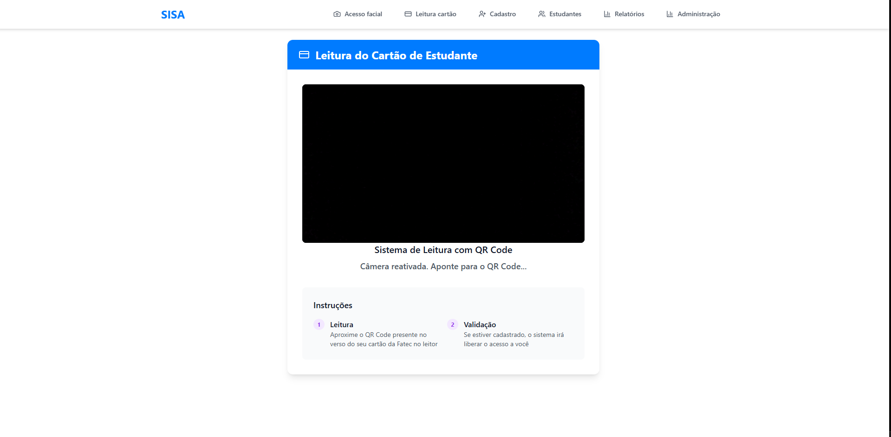
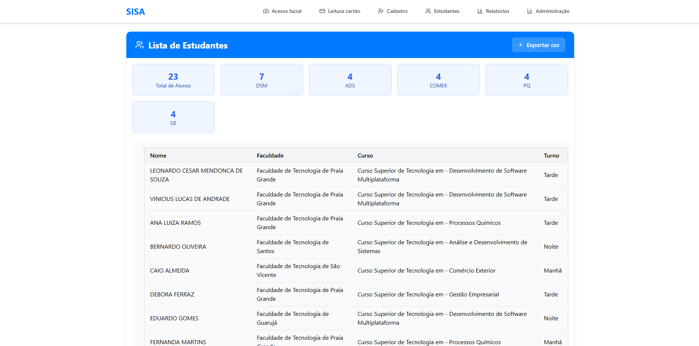
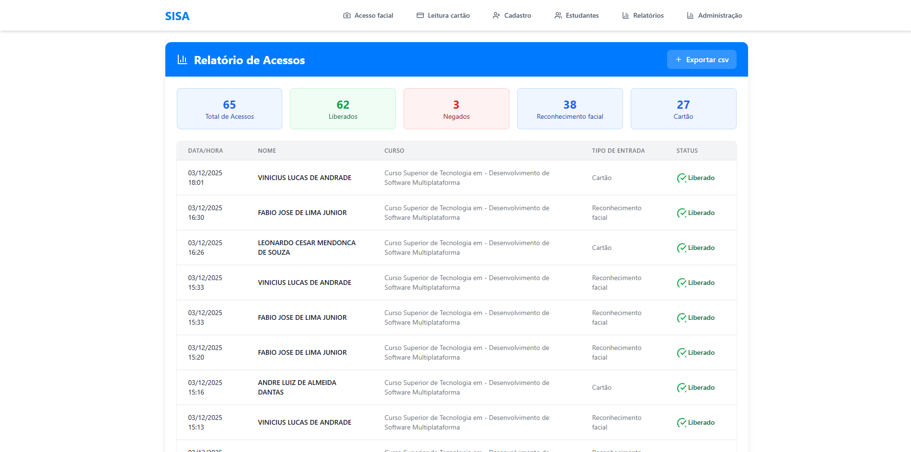

## 🛡️ SISA (Django)

Este projeto é um sistema de gestão e controle de acesso estudantil desenvolvido em Django. Ele permite validar a entrada de alunos de forma híbrida: através da leitura de QR Codes (em cartões físicos ou digitais) ou por Reconhecimento Facial via webcam.

  
  
  

## 🚀 Funcionalidades
Validação por QR Code: Leitura instantânea de códigos únicos vinculados ao ID do aluno.

Reconhecimento Facial: Comparação biométrica em tempo real.

Painel Administrativo: Gestão de alunos, logs de acessos e cadastro de fotos base.

Logs em Tempo Real: Registro de data, hora e status da tentativa de acesso (Liberado/Negado).
